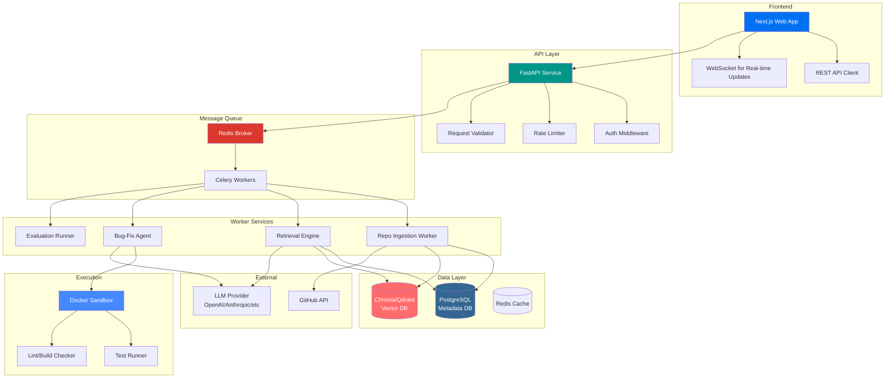

# RepoPilot: Codebase QA + Autonomous Bug-Fix Agent

[](https://opensource.org/licenses/MIT)
[](https://www.python.org/downloads/)
[](https://nextjs.org/)
[](https://fastapi.tiangolo.com/)

## 🎯 Overview

RepoPilot is an AI-powered developer tool that understands codebases, answers technical questions, and autonomously fixes bugs. It combines semantic code search, intelligent retrieval, and autonomous agent capabilities to help developers navigate and maintain complex codebases.

### Key Capabilities

1. **Codebase Intelligence**: Index and understand repository structure, dependencies, and symbols
2. **Semantic Search**: Answer questions like "Where is authentication implemented?" with cited sources
3. **Autonomous Bug Fixing**: Accept issue reports, propose patches, run tests, and iterate
4. **Evaluation Framework**: Benchmark retrieval accuracy, patch success rates, and system performance

## 🏗️ System Architecture



## 📁 Project Structure

```
repopilot/
├── apps/
│   └── web/                          # Next.js Frontend
│       ├── src/
│       │   ├── app/                  # App Router Pages
│       │   │   ├── dashboard/        # Main dashboard
│       │   │   ├── repo-ingestion/   # Repository upload/status
│       │   │   ├── code-search/      # Semantic code search
│       │   │   ├── issue-repair/     # Bug fix interface
│       │   │   ├── run-history/      # Execution history
│       │   │   ├── evaluations/      # Benchmark results
│       │   │   └── api/              # API routes
│       │   ├── components/           # React components
│       │   ├── lib/                  # Utilities & API clients
│       │   ├── hooks/                # Custom React hooks
│       │   └── styles/               # Tailwind & global styles
│       ├── public/                   # Static assets
│       ├── package.json
│       ├── tsconfig.json
│       ├── tailwind.config.ts
│       └── next.config.js
│
├── services/
│   ├── api/                          # FastAPI Backend
│   │   ├── app/
│   │   │   ├── api/v1/               # API Endpoints
│   │   │   ├── core/                 # Config, security, logging
│   │   │   ├── models/               # SQLAlchemy ORM models
│   │   │   ├── schemas/              # Pydantic schemas
│   │   │   ├── services/             # Business logic
│   │   │   └── workers/              # Celery task definitions
│   │   ├── tests/                    # API tests
│   │   ├── main.py
│   │   ├── requirements.txt
│   │   └── Dockerfile
│   │
│   └── worker/                       # Celery Worker Service
│       ├── app/
│       │   ├── agents/               # Bug-fix agent logic
│       │   ├── ingestion/            # Repo parsing & indexing
│       │   ├── retrieval/            # Search & ranking
│       │   ├── execution/            # Sandbox & test running
│       │   ├── evaluation/           # Benchmark framework
│       │   └── utils/                # Shared utilities
│       ├── tests/
│       ├── celery_app.py
│       ├── requirements.txt
│       └── Dockerfile
│
├── packages/
│   ├── shared/                       # Shared types & utilities
│   │   ├── __init__.py
│   │   └── constants.py
│   │
│   └── evals/                        # Evaluation benchmarks
│       ├── datasets/                 # Sample issues & repos
│       ├── metrics.py
│       └── runner.py
│
├── infra/
│   ├── docker/
│   │   ├── docker-compose.yml
│   │   ├── docker-compose.prod.yml
│   │   └── Dockerfile.*
│   └── scripts/
│       ├── seed_data.py
│       ├── setup_local.sh
│       └── run_evals.sh
│
├── docs/
│   ├── architecture.md
│   ├── api-reference.md
│   ├── deployment-guide.md
│   └── evaluation-methodology.md
│
├── .env.example
├── Makefile
├── README.md
└── pyproject.toml
```

## 🚀 Quick Start

### Prerequisites

- Docker & Docker Compose
- Python 3.10+
- Node.js 18+
- An LLM API key (OpenAI, Anthropic, or local model)

### Local Development Setup

```bash
# Clone the repository
git clone https://github.com/your-org/repopilot.git
cd repopilot

# Copy environment variables
cp .env.example .env

# Edit .env with your API keys
# LLM_API_KEY=your-key-here

# Start all services
docker-compose up -d

# Seed sample data
docker-compose exec api python -m app.services.seed_data

# Access the application
# Frontend: http://localhost:3000
# API Docs: http://localhost:8000/docs
```

### Manual Setup (Without Docker)

```bash
# Backend setup
cd services/api
pip install -r requirements.txt
uvicorn main:app --reload --host 0.0.0.0 --port 8000

# Worker setup (in separate terminal)
cd services/worker
pip install -r requirements.txt
celery -A celery_app worker --loglevel=info

# Frontend setup (in separate terminal)
cd apps/web
npm install
npm run dev
```

## 🔧 Configuration

### Environment Variables

| Variable | Description | Default |
|----------|-------------|---------|
| `LLM_PROVIDER` | LLM provider (openai, anthropic, ollama) | `openai` |
| `LLM_API_KEY` | API key for LLM provider | - |
| `LLM_MODEL` | Model name | `gpt-4-turbo-preview` |
| `DATABASE_URL` | PostgreSQL connection string | `postgresql://postgres:postgres@db:5432/repopilot` |
| `REDIS_URL` | Redis connection string | `redis://redis:6379/0` |
| `CHROMA_HOST` | ChromaDB host | `chromadb` |
| `CHROMA_PORT` | ChromaDB port | `8000` |
| `GITHUB_TOKEN` | GitHub API token (optional) | - |
| `SECRET_KEY` | JWT secret key | (auto-generated) |

## 📊 Features Deep Dive

### 1. Repository Ingestion

The ingestion service intelligently parses codebases:

- **Language Detection**: Identifies primary languages and applies appropriate parsers
- **Symbol Extraction**: Uses tree-sitter to extract classes, functions, imports
- **Smart Chunking**: Groups related code while preserving context
- **Dependency Graph**: Maps imports and module relationships
- **Embedding Generation**: Creates semantic embeddings for code chunks

```python
# Example: Ingested chunk metadata
{
    "file_path": "src/auth/login.py",
    "start_line": 45,
    "end_line": 78,
    "symbols": ["LoginHandler", "authenticate_user"],
    "imports": ["flask_login", "werkzeug.security"],
    "language": "python",
    "embedding_id": "uuid-v4"
}
```

### 2. Retrieval Engine

Hybrid retrieval combining multiple strategies:

- **Semantic Search**: Vector similarity on code embeddings
- **Keyword Search**: BM25 on code tokens and comments
- **Symbol-Aware**: Boost matches on class/function names
- **Path Boosting**: Prioritize relevant file paths
- **Recency Weighting**: Favor recently modified files

**Rank Fusion Formula:**
```
final_score = α*semantic_score + β*keyword_score + γ*symbol_boost + δ*path_boost
```

### 3. Codebase QA

Answer technical questions with citations:

**Query:** "Where is payment retry logic implemented?"

**Response:**
```markdown
Payment retry logic is implemented in three main locations:

1. **services/payment/retry_handler.py** (lines 23-67)
   - `RetryHandler` class with exponential backoff
   - Configurable max retries and delay

2. **services/payment/processor.py** (lines 145-189)
   - Integration with Stripe webhook handling
   - Retry queue management

3. **models/payment_attempt.py** (lines 78-102)
   - Database schema for tracking retry attempts
   - Status enumeration

The retry flow starts when a payment fails with a transient error...
```

### 4. Autonomous Bug-Fix Agent

Multi-step repair workflow:

```
Issue → Retrieve Context → Generate Plan → Create Patch → Run Tests → Iterate → Report
```

**Agent Loop:**
1. Parse issue and extract key requirements
2. Retrieve relevant files and functions
3. Generate step-by-step repair plan
4. Apply edits to create patch
5. Execute tests in sandbox
6. Analyze failures and retry (max 2 iterations)
7. Produce final report with confidence score

### 5. Evaluation Framework

Comprehensive benchmarking:

| Metric | Description | Target |
|--------|-------------|--------|
| Retrieval Recall@5 | % of relevant files in top 5 | >85% |
| Exact File Hit Rate | % of tasks with correct file #1 | >70% |
| Patch Success Rate | % of patches passing tests | >60% |
| Test Pass Rate | % of generated tests passing | >80% |
| Avg Latency | End-to-end time per task | <30s |
| Token Efficiency | Tokens used per successful fix | <5000 |

## 🔬 Evaluation Methodology

### Benchmark Dataset

We provide a curated dataset of real-world issues:

- **50 issues** from open-source repositories
- Spanning Python, JavaScript, TypeScript, Go
- Categorized by: bug type, complexity, required changes
- Includes ground truth: fixed files, expected behavior

### Running Evaluations

```bash
# Run full evaluation suite
python -m packages.evals.runner --dataset=sample_50 --output=results/

# Run specific metric
python -m packages.evals.runner --metric=retrieval_recall --k=5

# Generate report
python -m packages.evals.runner --generate-report
```

### Sample Results

```markdown
## Evaluation Results (Sample 50 Issues)

### Retrieval Performance
- Recall@5: 87.2% ✅
- Recall@10: 94.1% ✅
- MRR: 0.78

### Patch Generation
- Success Rate: 64% ✅
- Avg Iterations: 1.8
- Token Usage: 3,420 avg

### Latency
- P50: 12.4s
- P95: 28.7s
- P99: 45.2s
```

## 🛡️ Security & Safety

### Sandbox Execution

All code execution happens in isolated Docker containers:

- **No Network Access**: Prevents external calls
- **Resource Limits**: CPU, memory, disk quotas
- **Timeout Enforcement**: Max execution time per command
- **Read-Only Base**: Immutable base image
- **Ephemeral Storage**: Clean state per execution

### Rate Limiting

- API: 100 requests/minute per user
- LLM Calls: 10 concurrent requests max
- Sandbox: 5 parallel executions max

### Authentication

- JWT-based auth for API access
- Optional GitHub OAuth integration
- Role-based access control (admin, developer, viewer)

## 📈 Performance Optimization

### Caching Strategy

1. **Embedding Cache**: Avoid re-embedding unchanged files
2. **Retrieval Cache**: Cache frequent queries
3. **LLM Response Cache**: Cache similar prompts
4. **Test Result Cache**: Skip redundant test runs

### Latency Reduction

- **Async Processing**: Non-blocking I/O throughout
- **Streaming Responses**: Chunked LLM output
- **Parallel Retrieval**: Concurrent vector + keyword search
- **Batch Embeddings**: Group multiple chunks per API call

### Cost Optimization

- **Model Routing**: Use smaller models for simple tasks
- **Prompt Compression**: Minimize context window usage
- **Early Stopping**: Halt agent loop on success/failure
- **Tiered Retrieval**: Coarse→fine retrieval pipeline

## 🔮 Future Improvements

1. **Multi-Repo Support**: Cross-repository analysis and fixes
2. **PR Review Mode**: Automated code review suggestions
3. **Learning from Feedback**: Improve from accepted/rejected patches
4. **Custom Rules**: Company-specific coding standards enforcement
5. **Integration Hub**: Slack, Jira, Linear, GitHub Actions
6. **Local Model Support**: Run entirely on-prem with Llama/Mistral
7. **Incremental Indexing**: Update index without full re-ingestion
8. **Dependency Analysis**: Detect breaking changes in dependencies

## 💼 Interview Talking Points

### Scale Challenges

**Q: How would you scale this to 10,000 repositories?**

**A:** 
- Shard vector DB by repository/organization
- Implement distributed ingestion workers with work stealing
- Use hierarchical retrieval: repo→module→file→function
- Add CDN for embedding cache across regions
- Implement query routing based on repo affinity

### Retrieval Design

**Q: Why hybrid retrieval instead of pure semantic search?**

**A:**
- Semantic search struggles with exact symbol names (`getUserById`)
- Keyword search excels at precise identifiers
- Code has unique structure: imports, inheritance, calls
- Hybrid approach captures both intent (semantic) and precision (keyword)
- Symbol-aware boosting leverages AST information

### Sandbox Safety

**Q: How do you prevent malicious code execution?**

**A:**
- Docker with seccomp profiles and capability dropping
- No network namespace access
- Resource limits via cgroups
- Timeout enforcement at multiple layers
- Audit logging of all commands
- Whitelist allowed operations

### Evaluation Methodology

**Q: How do you measure success?**

**A:**
- Automated metrics: recall, precision, pass rate
- Human evaluation: patch quality, explanation clarity
- A/B testing: different retrieval strategies
- Production monitoring: acceptance rate, time saved
- Cost-benefit analysis: tokens vs. fix quality

### Latency/Cost Optimization

**Q: How do you balance speed, cost, and quality?**

**A:**
- Tiered model selection: small for retrieval, large for generation
- Adaptive context: expand only when confidence low
- Speculative execution: start tests before final patch
- Batch operations: group embeddings, API calls
- Graceful degradation: fall back to keyword-only if needed

## 📄 API Reference

See [docs/api-reference.md](docs/api-reference.md) for complete API documentation.

### Key Endpoints

```bash
# Ingest repository
POST /api/v1/repos/ingest
{
  "repo_url": "https://github.com/org/repo",
  "branch": "main"
}

# Ask question about codebase
POST /api/v1/codebase/query
{
  "question": "How is authentication implemented?",
  "repo_id": "uuid"
}

# Submit bug fix request
POST /api/v1/issues/fix
{
  "repo_id": "uuid",
  "issue_description": "Login fails with 500 error when...",
  "test_command": "pytest tests/test_auth.py"
}

# Get fix status
GET /api/v1/issues/{task_id}/status

# Run evaluation
POST /api/v1/evaluations/run
{
  "dataset": "sample_50",
  "metrics": ["retrieval_recall", "patch_success"]
}
```

## 🤝 Contributing

Contributions welcome! Please read our contributing guidelines first.

1. Fork the repository
2. Create a feature branch (`git checkout -b feature/amazing-feature`)
3. Commit your changes (`git commit -m 'Add amazing feature'`)
4. Push to the branch (`git push origin feature/amazing-feature`)
5. Open a Pull Request

## 📝 License

This project is licensed under the MIT License - see the LICENSE file for details.

## 🙏 Acknowledgments

- Inspired by tools like Sourcegraph, Sweep.dev, and Cursor
- Built with modern AI engineering best practices
- Designed for production deployment and scalability

---

**Built with ❤️ by the RepoPilot Team**

For questions or support, open an issue or contact us at team@repopilot.dev
